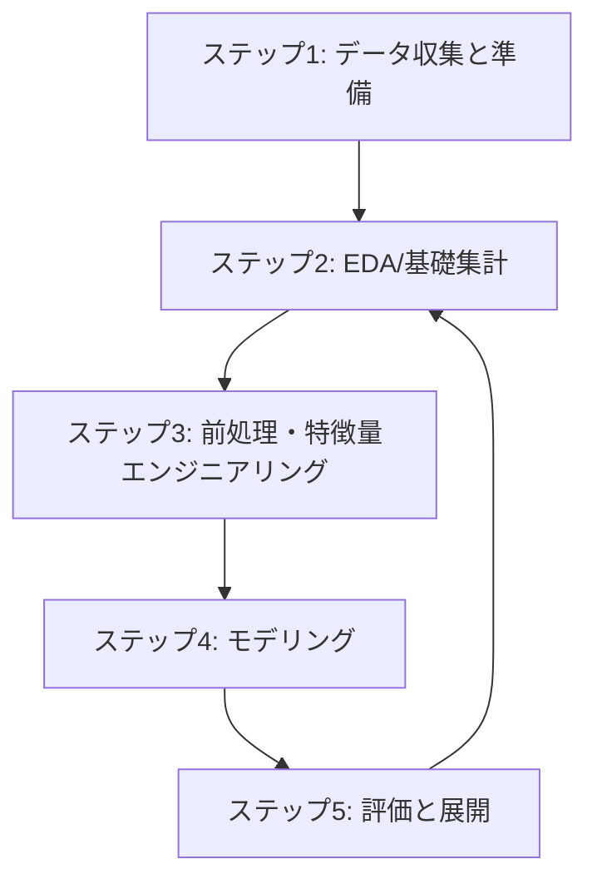

# データパイプライン・分析全体設計

**Document Management Information**
- Document ID: DOC-09-PIPELINE
- Version: 1.0
- Created: 2025-11-28
- Status: Active
- Target: データサイエンティスト・エンジニア

---

## 📋 目次

1. [予測モデル構築の5ステップ](#1-予測モデル構築の5ステップ)
2. [ステップ1: データ収集と準備](#2-ステップ1-データ収集と準備)
3. [ステップ2: EDA/基礎集計](#3-ステップ2-eda基礎集計)
4. [ステップ3: 前処理・特徴量エンジニアリング](#4-ステップ3-前処理特徴量エンジニアリング)
5. [ステップ4: モデリング](#5-ステップ4-モデリング)
6. [ステップ5: 評価と展開](#6-ステップ5-評価と展開)

---

## 1. 予測モデル構築の5ステップ

本プロジェクトでは、以下の標準的な5ステップのプロセスに従って予測モデルを構築・改善します。

### 各ステップの概要

| ステップ | 名称 | 目的 | 主要成果物 |
|---|---|---|---|
| **1** | **データ収集と準備** | 信頼性の高い生データの確保 | `past_results.csv`, `keisen_master.json` |
| **2** | **EDA/基礎集計** | データの理解、仮説の生成 | 基礎集計レポート、分析結果JSON |
| **3** | **前処理・特徴量** | モデルが学習可能な形式への変換 | 特徴量データセット (`*_data.pkl`) |
| **4** | **モデリング** | 予測モデルの学習と最適化 | 学習済みモデル (`*.pkl`) |
| **5** | **評価と展開** | 精度の検証と実運用 | 評価レポート、APIエンドポイント |

---

## 2. ステップ1: データ収集と準備

### 2.1 概要
ナンバーズの当選番号、リハーサル数字、およびkeisenマスターデータを収集・整備します。

### 2.2 主要コンポーネント
- **データソース**: みずほ銀行公式サイト、hpfree.com
- **スクリプト**: `scripts/02_data_preparation/`
- **データ格納**: `data/past_results.csv`

### 2.3 関連ドキュメント
- [03-data-api-design.md](./03-data-api-design.md): データAPI設計
- [08-keisen-master-creation.md](./08-keisen-master-creation.md): keisenマスター作成

---

## 3. ステップ2: EDA/基礎集計

### 3.1 概要
データの特性を理解し、モデル改善のための洞察を得ます。本プロジェクトでは、分析対象に応じて3つのカテゴリに分類して実施します。

### 3.2 分析カテゴリ

#### A. 共通分析
通常CUBE・極CUBEの両方に適用可能な、数字そのものの統計的性質の分析。
- **詳細**: [09-03_common-analysis-design.md](./09-03_common-analysis-design.md)
- **スクリプト**: `scripts/base_statistics/00_common/`
- **内容**: 数字出現パターン、時系列・周期性、数値パターン、異常値分析

#### B. 通常CUBE分析 (Legacy/Standard)
リハーサル数字を使用し、4パターン(A1-B2)に対応した従来のCUBE分析。
- **詳細**: [09-01_cube-analysis-design.md](./09-01_cube-analysis-design.md)
- **スクリプト**: `scripts/base_statistics/01_cube/`
- **内容**: keisen基礎集計、新旧比較、CUBE特性、相関分析

#### C. 極CUBE分析 (New/Extreme)
リハーサル数字に依存しない、N3専用・1パターンのみの新しいCUBE分析。
- **詳細**: [09-02_extreme-cube-analysis-design.md](./09-02_extreme-cube-analysis-design.md)
- **スクリプト**: `scripts/base_statistics/02_extreme_cube/`
- **内容**: 全期間基礎集計、並び型分析（V字型等）、区切り別比較

---

## 4. ステップ3: 前処理・特徴量エンジニアリング

### 4.1 概要
基礎集計で得られた知見を基に、モデルに入力するための特徴量を生成します。

### 4.2 特徴量カテゴリ (現在72次元)
1. **形状特徴**: ストレート、ボックス、セットなどの当選形状
2. **位置特徴**: 各桁の数字、合計値、奇数偶数など
3. **関係性特徴**: 前回・前々回との差分、リハーサル数字との距離など
4. **集約特徴**: 過去N回の出現頻度など
5. **パターンID**: keisenパターンIDなど

### 4.3 関連ドキュメント
- [04-algorithm-ai.md](./04-algorithm-ai.md): アルゴリズム詳細

---

## 5. ステップ4: モデリング

### 5.1 概要
LightGBM等の機械学習アルゴリズムを用いて、当選確率を予測するモデルを構築します。

### 5.2 モデル構成
- **アルゴリズム**: LightGBM (勾配ブースティング決定木)
- **タスク**: 二値分類 (当選/落選) または 多クラス分類
- **評価指標**: AUC-ROC, Accuracy, Precision, Recall

### 5.3 関連ドキュメント
- [04-algorithm-ai.md](./04-algorithm-ai.md): モデル学習手順

---

## 6. ステップ5: 評価と展開

### 6.1 概要
モデルの性能を厳密に評価し、本番環境（Vercel）へ展開します。

### 6.2 評価プロセス
- **オフライン評価**: 過去データを用いたバックテスト
- **オンライン評価**: 実運用での予測精度モニタリング

### 6.3 展開
- **API**: Vercel Serverless Functions (`api/py/`)
- **フロントエンド**: Next.js (`src/app/`)

### 6.4 関連ドキュメント
- [07-operations-quality.md](./07-operations-quality.md): 運用・品質管理
- [00_Vercel_Deployment.md](../02_todo/00_Vercel_Deployment.md): デプロイ手順
